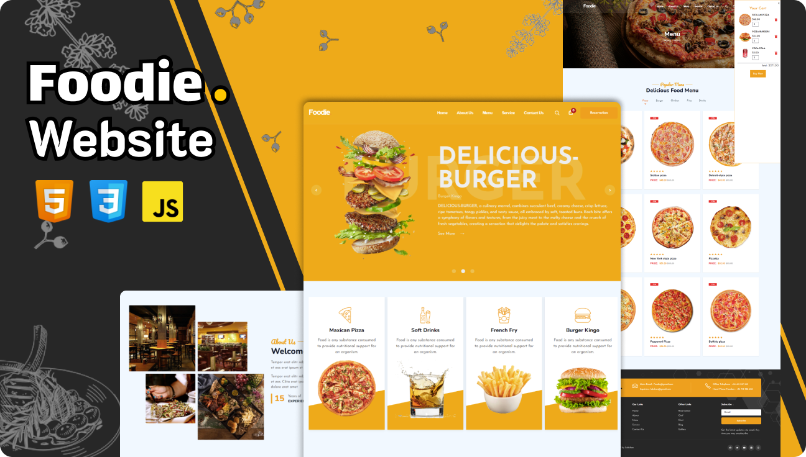

<div align="center">


[](https://www.linkedin.com/in/lakshan-rashmika-4a7566249/)
[](https://lakshan-a.github.io/New-Portfolio/)

  <br />
  <br />

<h2 align="center">Foodie. - Restaurant Website</h2>

Foodie. is a fully responsive Restaurant website, <br />Responsive for all devices, build using HTML, CSS, and JavaScript.

<a href="https://lakshan-a.github.io/Food_Web/" ><strong target="_blank">➥ Live Demo</strong></a>

</div>

<br />




### Prerequisites

Before you begin, ensure you have met the following requirements:

* [Git](https://git-scm.com/downloads "Download Git") must be installed on your operating system.

### Run Locally

To run **Fasteat** locally, run this command on your git bash:

Linux and macOS:

```bash
sudo git clone https://github.com/lakshan-a/Travel_Web.git
```

Windows:

```bash
git clone https://github.com/lakshan-a/Travel_Web.git
```

### Contact

If you want to contact with me you can reach me at [Linkedin](https://www.linkedin.com/in/lakshan-rashmika-4a7566249/).
